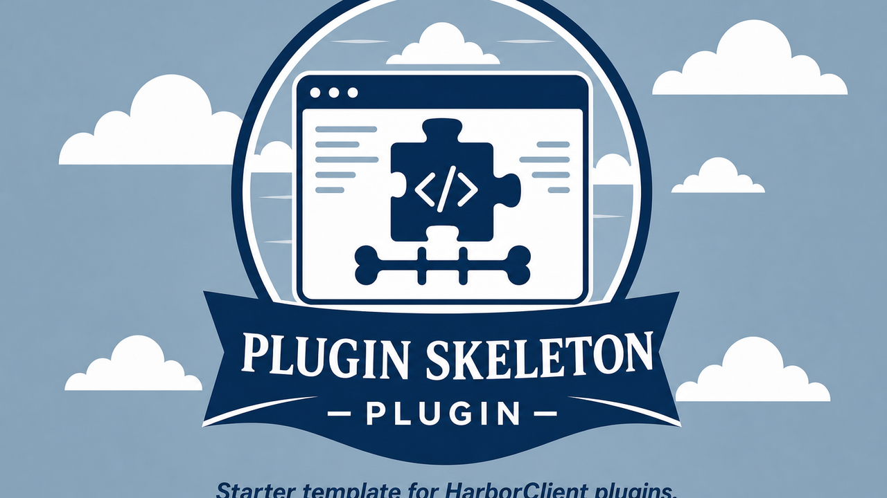

# Color

Sample colors from anywhere on screen with HarborClient's footer eyedropper panel.



## Features

- **Footer panel** — "🎨 Color" toggle slides up the eyedropper panel
- **Screen picker** — uses the Chromium EyeDropper API so the cursor becomes a system color picker
- **Formats** — HEX, RGB, HSL, HSV, and CMYK with one-click copy
- **Recent swatches** — last sampled colors persist via plugin storage

## Setup

```bash
pnpm install
pnpm build
```

Load the project folder in HarborClient via **Settings → Plugins → Load unpacked…**.

Requires `@harborclient/sdk@^1.0.67` from npm.

## Development

```bash
pnpm dev
```

Rebuilds `dist/renderer.js` on change. Keep the Color footer panel open for hot reload.

## Usage

1. Click **🎨 Color** in the footer bar.
2. Click **Pick color** — the cursor becomes the system eyedropper.
3. Click anywhere on screen to sample a pixel.
4. Copy any format row, or click a recent swatch to restore a previous color.

## Notes

- Screen picking needs the Web EyeDropper API (Chromium / Electron). On some Linux/Wayland setups or when screen permissions are denied, the panel shows an inline message and format conversion still works for entered/restored colors.
- The footer button uses a palette emoji because plugin footer contributions render title text only (no leading icon slot).

## Sign and verify

After building entry files, sign the plugin directory with an Ed25519 key:

```bash
pnpm sign -- --dir . --private-key /path/to/signing.pem --key-id my-publisher
pnpm verify -- --dir . --public-key /path/to/public.key
```
